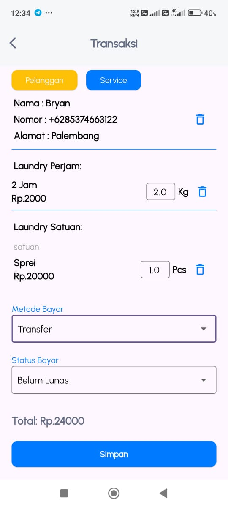

# Wash and Clean - Laundry Management App

<div align="center">
  
  
  
</div>

Wash and Clean adalah aplikasi manajemen laundry berbasis Flutter yang dirancang untuk mempermudah UMKM dalam mengelola layanan laundry mereka. Aplikasi ini dibuat sebagai bagian dari proyek akhir program MSIB Batch 7 dan ditargetkan untuk digunakan oleh UMKM laundry seperti *Ama Laundry* di Indralaya.

## Fitur Utama

1. **Manajemen Pesanan**
   - Tambah, ubah, dan hapus pesanan laundry.
   - Cek status pesan ( diambil dan belom diambil).

2. **Manajemen Pelanggan**
   - Simpan data pelanggan dengan nama, nomor telepon, dan alamat.
   - Fitur pencarian pelanggan untuk kemudahan layanan.

3. **Manajemen Transaksi**
   - Catat pembayaran dengan status lunas atau belum lunas.
   - Riwayat transaksi lengkap untuk audit.
   - Ekspor Xlsx file 

4. **Manajemen Paket Laundry**
   - Tambahkan paket layanan seperti Cuci Kering, Cuci Setrika, dll.
   - Atur harga per paket sesuai kebutuhan.

## Teknologi yang Digunakan

- **Flutter**: Untuk pengembangan aplikasi mobile.
- **Firebase**: Sebagai backend untuk autentikasi, penyimpanan data, dan notifikasi.
- **GetX**: Untuk state management dan navigasi.

## Cara Install

1. Clone repositori ini:
   ```bash
   git clone https://github.com/bryanhanggara/capstone
   ```

2. Masuk ke direktori proyek:
   ```bash
   cd capstone
   ```

3. Install dependensi:
   ```bash
   flutter pub get
   ```

4. Jalankan aplikasi:
   ```bash
   flutter run
   ```

## Tampilan Aplikasi

- Authentikasi

<div align="left">
  
  
</div>

- Halaman Utama
  
<div align="left">
  
</div>

- Layanan

<div align="left">
  
  
</div>

- Pelanggan

<div align="left">
  
  
</div>

- Transaksi

<div align="left">
  
</div>

- Laporan

<div align="left">
  
  
  
  
  
</div>

Dibuat dengan ❤ oleh tim HoneyComb untuk mendukung UMKM laundry berkembang lebih baik!
